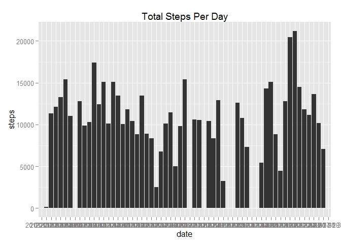
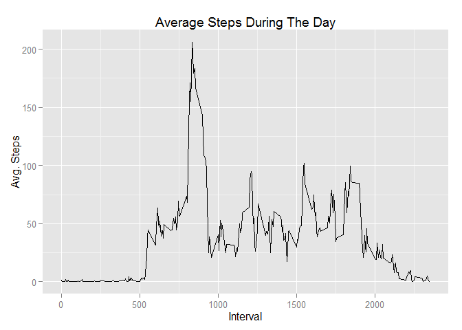
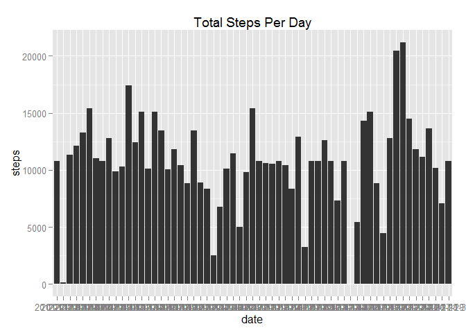
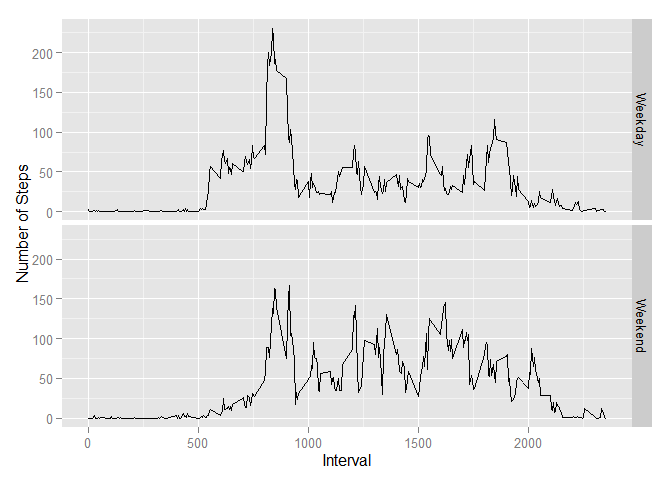

#Loading and preprocessing the data

```r
library(dplyr)
```

```
## Warning: package 'dplyr' was built under R version 3.2.2
```

```
## 
## Attaching package: 'dplyr'
## 
## The following objects are masked from 'package:stats':
## 
##     filter, lag
## 
## The following objects are masked from 'package:base':
## 
##     intersect, setdiff, setequal, union
```

```r
library(ggplot2)
```

```
## Warning: package 'ggplot2' was built under R version 3.2.2
```

```r
Data<-read.csv('activity.csv',header = TRUE)
```

#What is mean total number of steps taken per day?


```r
totalsteps<-group_by(Data,date) %>% summarize(steps=sum(steps,na.rm = TRUE))
meansteps<-mean(totalsteps$steps)
mediansteps<-median(totalsteps$steps)
qplot(x=date,y=steps,data=totalsteps,main = "Total Steps Per Day",geom="bar",stat="identity")  
```

 

The mean is 9354.2295082

The median is 10395

#What is the average daily activity pattern?

```r
avgsteps<-group_by(Data,interval) %>% summarize(avgsteps=mean(steps,na.rm=TRUE))
qplot(x=interval,y=avgsteps,data=avgsteps,main = "Average Steps During The Day",
      geom="line",xlab = "Interval", ylab = "Avg. Steps")
```

 

```r
maxinterval<-avgsteps$interval[avgsteps$avgsteps==max(avgsteps$avgsteps)]
```
It is the interval 835 contains the max number of the steps.

#Imputing missing values
Note that there are a number of days/intervals where there are missing values (coded as NA). The presence of missing days may introduce bias into some calculations or summaries of the data.

1. Calculate and report the total number of missing values in the dataset (i.e. the total number of rows with NAs)

```r
sum(is.na(Data$steps))
```

```
## [1] 2304
```


2. Devise a strategy for filling in all of the missing values in the dataset. The strategy does not need to be sophisticated. For example, you could use the mean/median for that day, or the mean for that 5-minute interval, etc.

```r
Data1<-Data
for (i in which(is.na(Data1$steps)) ){
        Data1$steps[i]<-avgsteps$avgsteps[avgsteps$interval==Data1$interval[i]]
}
```
3. Create a new dataset that is equal to the original dataset but with the missing data filled in.

4. Make a histogram of the total number of steps taken each day and Calculate and report the mean and median total number of steps taken per day. Do these values differ from the estimates from the first part of the assignment? What is the impact of imputing missing data on the estimates of the total daily number of steps?

```r
totalsteps1<-group_by(Data1,date) %>% summarize(steps=sum(steps,na.rm = TRUE))
qplot(x=date,y=steps,data=totalsteps1,main = "Total Steps Per Day",geom="bar",
      stat="identity")
```

 

```r
meansteps1<-mean(totalsteps1$steps)
mediansteps1<-median(totalsteps1$steps)
```
The mean is 1.0766189\times 10^{4}, median is 1.0766189\times 10^{4}. The values are different.  
Imputing missing data will eliminate the bias into the calculation of the data.

#Are there differences in activity patterns between weekdays and weekends?

```r
Data1$date<-as.Date(as.character(Data1$date), "%Y-%m-%d")

weekday<-c()
weekday[weekdays(Data1$date) %in% c("Monday","Tuesday", "Wednesday","Thursday",
                                    "Friday")]<-"Weekday"
weekday[weekdays(Data1$date) %in% c("Saturday","Sunday")]<-"Weekend"
Data2<-mutate(Data1, weekday = weekday)

avgsteps2<-group_by(Data2,interval,weekday) %>% 
        summarize(avgsteps=mean(steps,na.rm=TRUE))

qplot(x=interval,y=avgsteps,data=avgsteps2,geom="line"
      ,xlab = "Interval", ylab = "Number of Steps", facets = weekday ~ .)
```

 

